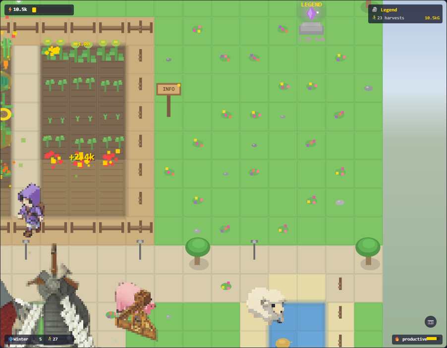

# AIFarm — Claude Buddy V3.0

透明 Electron 桌面夥伴，監控你的 Claude Code 工作階段，將它們化為**星露谷風格的像素農場模擬**。寫越多 code，世界越繁榮。



## 運作原理

Claude Buddy 透過 JSONL 日誌檔案監控你的 Claude Code 工作階段。每個程式碼事件（工具呼叫、思考、文字輸出）都會產生**能量**驅動你的農場：

- 作物自動生長並收成
- 動物隨里程碑解鎖，在牧場漫步
- 建築物隨進度出現在村莊區
- 你的夥伴（每個工作階段一個）自主在農場工作
- **你**控制玩家角色探索、賣貨、購物

## 功能一覽

### 玩家角色與控制
- WASD / 方向鍵移動，帶速度 + 摩擦力物理
- 金色帽 T「領主」角色，與 NPC 夥伴視覺區分（頭頂金色箭頭指示）
- 滑動瓷磚碰撞（4 角碰撞箱）
- 平滑 lerp 鏡頭跟隨（0.08）

### 資源經濟
- **多資源系統**：WOOD、STONE、GOLD 及各作物資源
- **出貨箱**：走近按 [E] 賣出作物/資源換取 GOLD
- **雜貨店**：走到工具小屋按 [E] 開啟商店
  - 購買種子（草莓、小麥）、加速藥水、田地擴張許可證
- 資源 HUD 列，帶 emoji 圖示與數值變化彈跳動畫
- 收穫時資源 icon 以弧形軌跡飛向 HUD

### 歷史工作階段 NPC
- 過去的 Claude Code 工作階段變成 NPC 角色在村莊漫步
- 依工作階段時長分進化等級：
  - **新手** (< 30 分鐘)：明亮顏色、快速走路、活潑
  - **老手** (30 分鐘 - 2 小時)：戴眼鏡、中等速度
  - **賢者** (> 2 小時)：白灰色、有鬍子、金色光暈、緩慢步伐
- 點擊 NPC 查看專案名稱、工作時長、日期
- 最多顯示 8 個 NPC，依等級多樣性篩選

### 等距農場引擎
- 3/4 俯視視角，32x32 瓷磚網格（20x18 地圖）
- 平滑鏡頭平移、縮放（滾輪）及閒置自動巡遊
- 多層 Z 排序渲染：地形、實體、粒子、天氣、HUD
- Event Bus 架構實現模組解耦

### 作物系統（6+ 種類）
紅蘿蔔、向日葵、西瓜、番茄、玉米、南瓜 — 各有 5 個生長階段。12 塊農田隨能量里程碑逐步解鎖。商店可購買新種子。

### 動物系統（6 種類）
雞、牛、豬、羊、貓、狗 — 在牧場漫步，帶閒置動畫與狀態機 AI（漫步、休息、反應）。

### 建築系統（7 棟建築）
水井、穀倉、風車、市場、鐘塔、市政廳、雕像 — 隨里程碑出現在村莊列。

### 夥伴 AI 行為
每個 Claude Code 工作階段生成一個夥伴角色，自主：
- 從工具小屋拿取工具
- 澆水與照顧動物
- 收穫成熟作物（帶粒子特效與浮動獎勵文字）
- 靠近其他夥伴時社交互動（emoji 聊天氣泡）
- **建造建築**：偵測到進行中的工地時，最多 2 名夥伴前往敲打（錘子動畫 + 火花/木屑粒子）

### 天氣與日夜循環
- 四季各有獨特天空漸層、地面色調與粒子效果
- 完整日夜循環：黎明、白天、黃昏、夜晚，平滑過渡
- 夜晚閃爍星星、農場小路溫暖路燈光暈

### 互動元素
- **佈告欄**：點擊開啟每日摘要（使用統計、農場進度、活動日誌）
- **金色小鳥**：稀有隨機訪客出現在圍欄上 — 點擊獲得額外閃光
- **紀念碑**：10,000 能量解鎖，帶脈動水晶與總 token 顯示
- **截圖模式**：HUD 相機按鈕將農場截圖為 PNG 含浮水印

### 火車系統
新夥伴搭火車抵達車站。成就解鎖觸發金色火車事件。

### 威望 / 世代系統
重置並擴張農場，跨世代長期進展。

### 荒野地標系統
遠離農場的 Chunk 會程序化生成地標（古代祭壇、廢棄營地、石圈、水晶洞穴、仙靈蘑菇圈）。走近按 [E] 探索獲得一次性資源爆發。累計能量越高，稀有地標出現率越高。

### 博物館與收藏
5000 能量解鎖博物館建築。按 [C] 開啟收藏目錄，追蹤地標、魚類、加工品、作物的發現進度。

### 玩家裝備
帽子與背包槽位，4 方向像素偏移對齊角色。草帽+基本背包預設裝備，探險帽/背包由地標探索解鎖。

### 自動化系統
商店購買灑水器（3×3 自動澆水）和自動收穫機（自動收成熟作物）。自動化需要 GOLD 維護費。

### 寵物狗同伴
3500 能量解鎖忠犬同伴，自動跟隨玩家角色。能偵測附近未探索地標並吠叫提醒。閒置時會坐下、偶爾玩耍。

### 紀念碑 2.0
10000 能量的紀念碑隨累計代幣和收藏進度動態成長：基座 → 水晶 → 方尖碑 → 高塔 → 宏偉尖塔。粒子效果隨等級增強。

### 四季變換
依系統月份自動切換春夏秋冬。每季有獨特樹木調色盤、粒子效果（春花瓣、夏螢火蟲、秋落葉、冬雪）。作物依季節有生長加成或減速。商店顯示作物當季狀態。

### NPC 委託看板
村莊中央的委託板，NPC 發布訂單（新手/老手/賢者級）。完成訂單交付資源獲 GOLD + 稀有道具。按 [Q] 開啟面板。

### 里程碑明信片 2.0
達成里程碑時自動截圖。電影式黑邊 + 金色暈光 + 里程碑標題。像素木框裝飾，自動下載 PNG。

### 氛圍系統
根據寫 code 模式即時偵測情緒（高效、專注、創意、挫折、平靜、閒置），影響天氣與動物行為。

### 技能系統
三技能分支（農業/採礦/釣魚），各 10 級 + 特技樹。收穫/釣魚/採礦自動累積 XP，收藏目錄「技能」分頁顯示等級徽章與進度條。狀態自動持久化。

### 烹飪系統
小屋壁爐互動開啟烹飪面板：烤魚（回滿體力）、手工麵包（3 分鐘加速 buff）、高級狗零食（5 分鐘寵物產金 buff）。Buff 圖示帶倒計時顯示於畫面右上。

### 音效引擎
Web Audio API 合成 8-bit 音效：UI 點擊、收穫彈出、錯誤蜂鳴、升級琶音、烹飪叮噹。瀏覽器自動播放解鎖。

### 漸進式建造系統
建築物由 token 燃燒逐步建造（每個能量事件 = 建造進度）：
- 4 階段視覺：地基（木樁+繩線）→ 鷹架（木框+半牆）→ 框架（磚牆+屋頂骨架）→ 完工（煙火慶祝）
- 進度條懸浮於工地上方
- AI 夥伴自動前往工地敲打（最多 2 人）
- [T] 鍵測試用 token 模擬器

### SQLite 狀態儲存
從 JSON 檔案遷移至 SQLite（WAL 模式），支援增量寫入。首次啟動自動從 farm-state.json 遷移，後續只更新變動的資料列。

### 動態資源管理器
外部 JSON manifest 定義精靈圖資源，支援懶加載（首次繪製時載入）、重試機制、併發佇列。為未來 UGC 建築/角色做準備。

### 多人連線原型
輕量 WebSocket 伺服器 + 客戶端。6 Hz 位置廣播，lerp 插值平滑移動。遠端玩家以半透明「幽靈」渲染，帶團隊名稱標籤。

### Webhook 神諭系統
外部系統透過 HTTP POST `/api/webhook` 發送事件，伺服器廣播至所有連線玩家：
- **金雨**：10 秒金色粒子雨 + 金幣 emoji + 畫面金色濾鏡 + 50 能量獎勵
- **資料水晶**：紀念碑區域閃爍水晶 + 100 金幣獎勵
- **公告橫幅**：5 秒淡入淡出金色邊框橫幅

### 玩家交易系統
走近遠端幽靈玩家按 [T] 開啟交易：
- 木框羊皮紙風格交易面板
- 雙欄顯示：我方出價 vs 對方出價
- 方向鍵選擇資源與數量，Enter 確認
- 雙方確認後原子交換資源

### UGC 資產匯入
自動監控 `renderer/assets/custom/` 資料夾。PNG 檔名慣例自動解析精靈圖元資料（如 `character-ninja_32x32_4f.png`），即時註冊到 AssetManager 供遊戲使用。

### 動態浮動經濟
- **均值回歸價格模型**：每 10 秒基於 Ornstein-Uhlenbeck 過程更新物價（±20% 波動）
- **牛市事件**：Webhook 觸發 `bull_market` → 全品收購價 +50%，持續 10 分鐘
- **行情看板**：村莊廣場的交易行情板，紅/綠箭頭顯示各作物漲跌趨勢

### 遊戲手把支援
HTML5 Gamepad API 完整整合：
- 左搖桿 / D-Pad：8 方向移動
- A 鍵：互動 [E]、B 鍵：取消 [ESC]、X 鍵：收藏 [C]、Y 鍵：委託 [Q]
- RT / R2：衝刺、Start：交易
- 自動偵測手把輸入，切換 UI 提示圖示

### 新手教學引導
初次遊玩自動啟動 6 步教學（賢者 NPC 引導）：
- 歡迎對話 → 走到農田 → 等待收穫 → 出貨箱賣貨 → 造訪商店 → 完成慶祝
- 金色脈動目標圈 + 彈跳箭頭指向目標位置
- 底部對話框自動換行，[Enter] 推進或等待遊戲事件自動觸發
- 進度持久化（重啟不會重複教學）

### 世界隨機事件
每 5-15 分鐘隨機觸發一次驚喜事件：
- **流星墜落**：紫色水晶著陸，走近按 [E] 收集 30-50 石頭
- **流浪商人**：出售稀有種子/水晶碎片/金蘋果，需要 GOLD 購買
- **仙靈花環**：蘑菇圈發光，走近按 [E] 獲得全技能 +50 XP
- 事件 5 分鐘後消失，帶脈動光圈 + 倒計時進度條

### 環境音效
Web Audio API 程序化合成環境音（無需音檔）：
- 雨聲：粉紅噪音 + 帶通濾波器（下雨時）
- 流水聲：粉紅噪音 + 低通濾波器（靠近水源時）
- 風聲：白噪音 + 低通濾波器（暴風雨時）
- 鳥鳴：正弦波啁啾（白天隨機）
- 蟋蟀：高頻脈衝（夜間）
- 音量隨距離與環境條件平滑過渡

### 畫面後製濾鏡
[F9] 循環切換全屏視覺效果：
- **CRT 復古**：掃描線 + 徑向暈影 + 綠色磷光色調 + 隨機閃爍
- **暖陽黃昏**：橙色濾鏡覆蓋 + 暖色暈影

### NPC 好感度與贈禮
走近 NPC 按 [G] 贈送物品，建立友誼：
- 0-10 顆心好感度系統，依 NPC 等級有不同物品偏好
- **喜愛品** +3 心、**普通** +0.5、**討厭** -1
- 好感度里程碑回贈：3 心 25g、5 心稀有種子、7 心 100g、10 心 500g
- 底部提示框顯示 NPC 名稱、友誼心數、對話

### 天氣影響 2.0
天氣不只是視覺，真正影響遊戲策略：
- **閃電威脅**：雨天隨機落雷，擊中樹木轉為 +5 木材（焦炭）
- **作物加成**：雨天 +25% 生長速度；夏季乾旱期間作物停止生長
- **室內避難**：雨天待在室內每 5 秒獲得「溫馨」buff（+2 GOLD）
- 閃電白屏閃爍 + 乾旱橙色濾鏡 + HUD 倒計時

### 引擎監測儀表板
[F3] 開啟半透明數據面板：
- FPS 計數器（綠/黃/紅三色等級）
- 玩家座標、Chunk ID、實體數量
- 天氣狀態、季節、時間、生長倍率
- 網路連線狀態、後製濾鏡、NPC 數量

### 傳奇黃金尖塔
紀念碑 2.0 達最終階段 + 圖鑑 100% 完成時觸發「升天儀式」：
- 紀念碑化為流動黃金材質 + 全地圖 1 分鐘彩色煙火
- 解鎖「傳奇領主」稱號 + 無限體力 buff
- 金色光暈 HUD 永久顯示

### 全域數值平衡
Sprint 30 最終平衡調整：
- 玩家移動速度 +15%（256x256 大世界適配）
- 市場均值回歸速度降低（價格波動更持久）
- 低階作物價值提升（早期作物保持相關性）
- 體力消耗 -15%（鼓勵探索）

### 啟動畫面與製作名單
- 啟動時 3 秒「AIFarm 3.0」黃金標題動畫
- [F1] 開啟製作名單（開發團隊 + Sprint 歷程 + 技術棧）
- [F4] 匯出存檔備份（SQLite 資料庫）
- **無**：原始畫面（預設）

## 操作方式

| 輸入 | 動作 |
|------|------|
| WASD / 方向鍵 | 移動玩家角色 |
| 滑鼠滾輪 | 縮放 |
| E | 互動（購物 / 賣貨 / 釣魚 / 探索地標） |
| Q | 開啟/關閉 NPC 委託看板 |
| C | 開啟/關閉博物館收藏目錄 |
| W/S + Enter | 瀏覽商店選單 |
| Escape | 關閉商店 |
| 點擊 NPC | 查看工作階段資訊 |
| 點擊佈告欄 | 開啟每日摘要 |
| 點擊相機按鈕 | 儲存農場截圖 |
| T | 與附近幽靈玩家交易（或按住模擬 token 燃燒） |
| G | 贈送物品給附近 NPC（建立好感度） |
| F1 | 開啟/關閉製作名單 |
| F3 | 開啟/關閉引擎監測儀表板 |
| F4 | 匯出存檔備份 |
| F9 | 循環切換畫面濾鏡（無 → CRT → 暖陽） |
| F11 | 全螢幕模式切換 |
| Ctrl+Shift+I | 切換等距/經典視角 |
| Ctrl+Shift+D | 切換 debug 平移 |

## 能量里程碑

| 能量 | 里程碑 | 解鎖內容 |
|------|--------|----------|
| 50 | 第一顆種子 | 紅蘿蔔、農田 1-3 |
| 150 | 園丁 | 向日葵 |
| 300 | 綠手指 | 西瓜 |
| 500 | 農夫 | 番茄、農田 4-6、雞 |
| 800 | 牧場主 | 玉米、牛 |
| 1,200 | 拓荒者 | 南瓜、豬、水井 |
| 1,800 | 村民 | 羊、穀倉 |
| 2,500 | 城鎮建造者 | 貓、風車 |
| 3,500 | 繁榮 | 狗、市場 |
| 5,000 | 興盛 | 鐘塔、農田 7-9 |
| 7,500 | 大都會 | 市政廳 |
| 10,000 | 傳奇 | 雕像、紀念碑 |

## 開發進度

### 已完成

| Sprint | 名稱 | 功能 |
|--------|------|------|
| 11 | 工具小屋與農場日誌 | 工具小屋建築、農場活動日誌、角色配件 |
| 12 | 社交生活 | 夥伴社交氣泡、紀念碑系統、金色小鳥事件 |
| 13 | 氣氛營造 | 日夜循環、截圖模式、閒置自動巡遊 |
| 14 | 財富之種 | 資源庫存 + Event Bus、資源 HUD、出貨箱 |
| 15 | 智慧成長 | 歷史工作階段 NPC、雜貨店/商店、資源飛出動畫 |
| 16 | 無限地平線 | Chunk 無限地圖、動態光照 2.0、衝刺與體力系統 |
| 17 | 工業革命 | 加工建築（磨坊/工坊）、動態天氣系統、圓形小地圖 |
| 18 | 社交與生態 | 動物繁殖系統、夥伴社交 2.0、釣魚小遊戲 |
| 19 | 大探險與文物 | 荒野地標系統、博物館與收藏目錄、玩家裝備自訂 |
| 20 | 自動帝國與忠犬 | 自動灑水器/收穫機、寵物狗同伴、紀念碑 2.0 |
| 21 | 四季與繁忙村莊 | 四季變換系統、NPC 委託看板、里程碑明信片 2.0 |
| 22 | 大修復與無限家園 | 確定性巨型地圖（256x256）、Z-Sorting 深度重構、室內轉場系統、實體動畫校準 |
| 23 | 大師之路與廚藝 | 技能系統（農/礦/釣 + 特技樹 + UI）、烹飪系統（3 食譜 + buff）、音效引擎（Web Audio 合成） |
| 24 | 建築師覺醒 | 漸進式建造系統（8 藍圖 + 4 階段視覺）、AI Builder NPC（錘子動畫 + 木屑火花粒子） |
| 25 | 多人基建與引擎優化 | SQLite 狀態儲存遷移、動態資源管理器、WebSocket 多人連線原型 |
| 26 | 神諭與市集 | HTTP Webhook API（外部事件觸發視覺效果）、玩家對玩家交易系統、UGC 資產匯入器 |
| 27 | 華爾街農場 | 動態浮動經濟系統（均值回歸 ±20%）、遊戲手把支援（Gamepad API）、記憶體優化掃除 |
| 28 | 盛大慶典 | 新手教學引導系統、世界隨機事件（流星/商人/仙靈）、環境音效合成、畫面後製濾鏡 |
| 29 | 最終地平線 | NPC 好感度與贈禮系統、天氣影響 2.0（閃電/乾旱/溫馨 buff）、引擎監測儀表板 |
| 30 | 盛大終曲 | 傳奇黃金尖塔升天儀式、全域數值平衡、啟動畫面與製作名單 |

### 待辦（路線圖）

| 階段 | Sprint | 優先級 | 功能 | 說明 |
|------|--------|--------|------|------|
| 7 | 25 | P0 | 工作動畫系統 | 夥伴工具持握動畫、揮鋤/澆水/敲打多幀動畫 |
| 7 | 25 | P1 | 更多作物品種 | 草莓、小麥實際成長階段 + 精靈圖 |
| 7 | 25 | P2 | 資源鏈 | 資源加工路線（小麥→麵粉→麵包） |
| 7 | 26 | P0 | Chunk 無限地圖 2.0 | 動態載入/卸載 Chunk、程序化生物群落 |
| 7 | 26 | P1 | 天氣/季節 NPC 生命系統 | NPC 依天氣/季節改變行為模式 |
| 7 | TBD | P1 | 科技樹升級 | 工具效率升級系統、研究進度 |
| 7 | TBD | P2 | 房屋自訂 | 玩家房屋內部裝潢系統 |
| 7 | TBD | P1 | AI 廣播板 | NPC 即時評論 git commit |
| 7 | TBD | P2 | 貿易與外交 | 跨專案資源交易模擬 |

## 快速開始

```bash
npm install
npm start
```

需要有進行中的 Claude Code 工作階段，寫入 JSONL 日誌到 `~/.claude/projects/`。

## 架構

```
claude-buddy/
  main.js              # Electron 主程序、工作階段監控、IPC
  preload.js           # 主程序與渲染程序的橋接
  farm/
    farm-config.js     # 常數：能量值、作物、動物、里程碑
    farm-state.js      # 農場狀態管理、成長邏輯、持久化（SQLite）
    database-adapter.js  # SQLite 資料庫適配器（WAL 模式）
    achievement-manager.js  # 成就追蹤與解鎖邏輯
  renderer/
    iso-engine.js      # 瓷磚式渲染引擎、鏡頭、粒子
    iso-farm.js        # 農場佈局、實體、HUD、截圖、自動巡遊
    iso-entity-manager.js  # 實體生命週期（角色、動物、靜態物）
    iso-weather.js     # 季節、天氣粒子、日夜循環、動態天氣
    iso-lighting.js    # 動態光照系統（夜間燈光、光暈）
    iso-train.js       # 火車進出站動畫
    iso-effects.js     # 浮動文字、收穫獎勵、資源飛出動畫
    iso-fishing.js     # 釣魚小遊戲系統（計時挑戰）
    landmark-generator.js  # 荒野地標生成與互動（祭壇、營地、石圈）
    collection-ui.js   # 博物館收藏目錄 UI（地標、魚、產品、作物）
    player-accessories.js  # 玩家裝備系統（帽子、背包槽位）
    automation-logic.js    # 自動化系統（灑水器、自動收穫機）
    pet-ai.js              # 寵物狗 AI（跟隨、偵測地標、休息）
    monument-v2.js         # 紀念碑 2.0（動態成長、多階段視覺）
    iso-seasons.js     # 四季系統（樹木調色盤、螢火蟲、雪、作物季節）
    quest-board.js     # NPC 委託看板（訂單、獎勵、資源回收）
    snapshot-v2.js     # 里程碑明信片 2.0（自動截圖、相框、劇場模式）
    iso-tooltip.js     # 實體懸停提示
    iso-ui.js          # 模態覆蓋層（佈告欄）
    shop-ui.js         # 雜貨店商店模態
    event-bus.js       # 發布/訂閱事件系統
    resource-inventory.js  # 多資源庫存（WOOD、STONE、GOLD、作物）
    processing.js      # 加工建築系統（磨坊、工坊）
    minimap.js         # 圓形小地圖 HUD
    chunk-manager.js   # 無限地圖 Chunk 系統
    npc-manager.js     # 歷史工作階段 NPC 系統與進化等級
    player.js          # 玩家控制角色與物理
    buddy-ai.js        # 自主夥伴行為（農作、社交、建造）
    skill-system.js    # 技能系統（農業/採礦/釣魚 + 特技樹）
    cooking-system.js  # 烹飪系統（食譜、buff 狀態機）
    audio-manager.js   # Web Audio API 合成 8-bit 音效
    construction-manager.js  # 漸進式建造系統（4 階段視覺）
    asset-manager.js   # 動態資源管理器（懶加載、JSON manifest）
    network-client.js  # WebSocket 多人連線客戶端
    oracle-effects.js  # Webhook 神諭視覺效果（金雨、水晶、公告）
    trade-ui.js        # 玩家對玩家交易 UI（木框面板、資源交換）
    market-economy.js  # 動態浮動經濟系統（均值回歸定價、牛市事件、行情板）
    gamepad-input.js   # HTML5 Gamepad API 手把輸入整合
    tutorial-manager.js  # 新手教學引導系統（6 步驟、Sage NPC）
    world-events.js    # 世界隨機事件（流星、流浪商人、仙靈花環）
    ambient-audio.js   # 環境音效合成（雨/水/風/鳥/蟋蟀）
    post-processing.js # 畫面後製濾鏡（CRT 復古、暖陽黃昏）
    friendship-system.js # NPC 好感度與贈禮系統（0-10 心、物品偏好）
    weather-logic-v2.js  # 天氣影響 2.0（閃電、乾旱、溫馨 buff）
    debug-dashboard.js   # 引擎監測儀表板（FPS、座標、實體、網路）
    victory-monument.js  # 傳奇黃金尖塔（升天儀式、煙火、傳奇稱號）
    global-balance.js    # 全域數值平衡（速度、經濟、作物價值）
    credits-screen.js    # 啟動畫面與製作名單（F1 Credits、F4 存檔匯出）
    farm.js            # 渲染端共享農場狀態
    sprite-manager.js  # PNG 精靈圖載入與程序化回退
    character.js       # 8 色帽 T 角色精靈圖
    scene.js           # 經典 2D 視角背景
    viewport.js        # 鏡頭視窗管理
    speech-bubble.js   # 聊天氣泡渲染
    state-machine.js   # 活動狀態機
    train.js           # 經典 2D 火車
    renderer.js        # 主渲染迴圈、輸入處理、視角管理
  server/
    multiplayer-server.js  # WebSocket+HTTP 多人伺服器（含 Webhook API）
  watcher/
    data-exporter.js   # JSONL 匯出工具
    ugc-importer.js    # UGC 自定義資產匯入器（資料夾監控）
  scripts/
    recolor_sprites.py # 精靈圖 HSV 色相偏移重新上色
```

## 技術棧

- **Electron** — 透明置頂桌面視窗
- **Canvas 2D** — 所有渲染皆為純 Canvas（無 WebGL、無框架）
- **Node.js** — JSONL 檔案監控、農場狀態持久化
- **Event Bus** — 資源、商店、NPC 系統的發布/訂閱解耦

## 開發團隊

- **Joe** — 決策者，串接所有 AI 協作者
- **Claude** — 主要開發者/執行者
- **Gemini CTO** — 架構決策與程式碼審查
- **Gemini PM** — 功能優先級與 Sprint 規劃

## 授權

MIT
